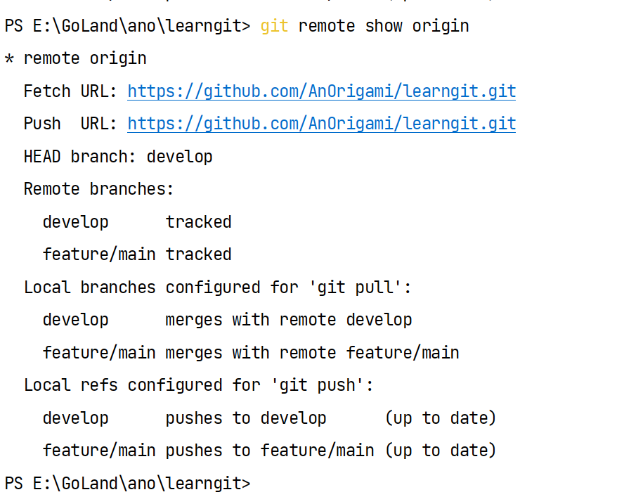

# learn git

## git 基础

### git init

在项目根目录下执行此命令，生成一个.git文件，初始化git

- workspace/untracked:工作区
- staged：暂存区
- unmodified:commit的这里完成一次快照
- modified:修改区间

create file：untracked 通过add 变成staged
staged通过commit变成一次提交/unmodified

### git clone

git clone https://www.github.com/AnOrigami/captcha
从远程仓库克隆项目到运行此命令的目录下，但是项目名为远程仓库项目名
git clone https://www.github.com/AnOrigami/captcha mycaptcha
对克隆到本地进行重命名

### git add

将工作区的文件（未追踪的文件）通过add变为暂存区文件（已追踪文件）

- git add ./utils/monmgodb.go //传入一个路径或具体文件 使用add从工作区保存到暂存区
- git add . //将当前路径下所有工作区的文件和文件夹add到暂存区

### git status

查看当前文件状态

git status -s
git status --short
状态简览

### .gitignore

标明忽略文件，可以使用glob模式
在项目根目录下创建.gitignore这个文件，对于这个文件中指定的文件或路径，git add/git commit都会忽略这些文件

### git diff

查看已暂存和未暂存的modify
git diff通过文件补丁的格式具体的显示出哪些行为发生了变化

git diff --staged/--cached:这条命令将比对已暂存文件与最后一次提交的文件差异
git diff 本身只显示尚未暂存的改动，而不是自上次提交以来所做的所有改动

### git commit

基于暂存区文件进行commit为一次快照

git commit -a :这个操作会将已追踪的所有文件进行commit
git commit -m "hello git commit":对这次commit进行注释

### git rm

从跟踪文件清单中移除，本地也会删除这个文件
git rm file.go
git rm -f file.go
如果是放到暂存区的文件，则需要添加-f进行强制rm操作

git rm --cached file.go:本地不会删除，会从git的暂存区删除

### git mv

git mv file_from file_to

### git log

查看commit记录：最新时间排在最上面

git log -p/--patch:以补丁方式显示每次提交所引入的差异

git log -p -5:显示最近5次的commit

git log --stat:附带每次提交的总结（简略统计信息）

git log --pretty=oneline/short/full/fuller:四种pertty的方式进行展示

git log --pretty=format:"%h - %an, %ar : %s":定制显示格式

其他限制见官网：https://git-scm.com/book/zh/v2/Git-%E5%9F%BA%E7%A1%80-%E6%9F%A5%E7%9C%8B%E6%8F%90%E4%BA%A4%E5%8E%86%E5%8F%B2

### git commit --amend

撤销操作 --amend

"git restore --staged <file>...":两个文件已经add，但是只需要一个文件add，可以使用这个命令restore一个文件

每次add或者commit或者modify之后，可以通过git statue查看状态，会显示如何撤销的操作

### remote repository

git remote:输出远程仓库的简写origin
git remote -v:显示需要读写远程仓库使用的 Git 保存的简写与其对应的URL

git remote add origin URL

- 添加远程仓库
- origin为short的具体值
- URL要换成一个自己仓库的url
- git fetch shortname:可以使用这个设置的shortname进行fetch

git clone URL.git 会默认远程仓库的shortname为origin

### git fetch <remote>

- 从远程仓库中拉取所有你没有的数据
- <remote>可以使用shortname或URL
- 只会将数据下载到本地，并不会自动合并或者修改你当前的工作，后续需要手动合并进入你的工作

### git pull

- git pull <remote-short-name> <remote-branch>
- 如果你的当前分支设置了跟踪远程分支（阅读下一节和 Git 分支 了解更多信息）， 那么可以用 git pull 命令来自动抓取后合并该远程分支到当前分支。
- 默认情况下，git clone 命令会自动设置本地 master 分支跟踪克隆的远程仓库的 master 分支（或其它名字的默认分支）。
- 运行 git pull 通常会从最初克隆的服务器上抓取数据并自动尝试合并到当前所在的分支。

### git push

git push <remote> <branch>
<remote>为shortname

### fetch/pull

**fetch:**从remote抓取数据到本地，但是不会更改当前工作区的内容，
remote两次commit，本地一次commit的时候，本地进行fetch后，本地还是一次commit，
需要进行显示的merge才会更改本地。

**pull:**会查找当前分支所跟踪的服务器与分支， 从服务器上抓取数据然后尝试合并入那个远程分支，
相当于fetch+merge。

### git remote show

git remote show <remote>

这个命令列出了当你在特定的分支上执行 git push 会自动地推送到哪一个远程分支。
它也同样地列出了哪些远程分支不在你的本地，哪些远程分支已经从服务器上移除了，
还有当你执行 git pull 时哪些本地分支可以与它跟踪的远程分支自动合并。

### remote rename/remove

git remote rename <old shortname> <new shortname>
这同样也会修改你所有远程跟踪的分支名字。

git remote remove shortname/git remote rm shortname
移除远程仓库
你使用这种方式删除了一个远程仓库，那么所有和这个远程仓库相关的远程跟踪分支以及配置信息也会一起被删除。

### git tag

列出标签
这个命令以字母顺序列出标签，但是它们显示的顺序并不重要。
你也可以按照特定的模式查找标签： git tag -l "v1.8.5*"（想要匹配必须加-l或者--list）
人们会使用这个功能来标记发布结点（ v1.0 、 v2.0 等等）

- git tag
- git tag -l
- git tag --list

Git 支持两种标签：轻量标签（lightweight）与附注标签（annotated）。

- **附注标签**(创建标签)
- git tag -a v1.4 -m "my version 1.4"
- 对最近一次的commit快照进行打标签
- -a指明为附注标签，标签为v1.4
- -m指定注释信息，如果没有为附注标签指定一条信息，Git 会启动编辑器要求你输入信息。

- **轻量标签**(创建标签)
- git tag v1.4-lw
- 不需要使用 -a、-s 或 -m 选项，只需要提供标签名字

- **对之前的commit进行打tag**
- git log --pretty=oneline:显示历史commit
- git tag -a v1.2 9fceb02
- -a进行打附注标签，标签为v1.2
- 9fceb02为部分校验和

- **共享标签**
- git push不会将tag进行push到remote
- 必须显示的push标签
- git push origin <tagname>：推送指定的这个tag
- git push origin --tags：这将会把所有不在远程仓库服务器上的标签全部传送到那里。
- 必须指定<remote-shortname>
- 只会向远程push tag，不会push commit

- **删除标签**
- git tag -d <tagname>
- 上述命令并不会从任何远程仓库中移除这个标签，你必须用 git push <remote> :refs/tags/<tagname> 来更新你的远程仓库
- git push <remote-shortname> :refs/tags/<tagname>
- git push origin --delete <tagname>

- **签出标签**
- git checkout <tag-name>
- 这会使你的仓库处于“分离头指针（detached HEAD）”的状态
- **非必须 禁止使用此命令**

### git show

git tag获取标签
git show <tag>:显示标签信息
git log 用于查看提交历史的概览，而 git show 则用于查看特定提交的详细信息和更改内容。

## git 分支管理

### 分支创建

git branch branch-name
在当前commit的对象上创建一个指针
只是创建一个新的分支，并不会改变HEAD指向
HEAD是一个特殊指针，指向当前所在分支

git log --oneline:会显示分支指向那个commit，和HEAD指向（包括remote和local的分支）

git checkout -b branch-name:创建新分支，并切换HEAD到这个新分支上
git checkout -b <local-branch> origin/branch-name:创建新分支并与远程分支联系
git it checkout -b branch-name=it checkout -b branch-name origin/branch-name

git branch -u origin-branch:当前local分支重新创建与远程分支的联系

### 分支切换

git log --oneline会显示所有分支

使用git checkout branch-name切换到指定分支
同时更改HEAD指针的指向

### 分支新建与合并

背景介绍：master分支在v1.0版本（已发布，正在使用这个版本），基于当前master，创建了一个新分支iss22进行开发,
此时开发完成或开发进行中，但是，对于发布的v1.0有错误，需要基于master主分支创建一个hotfix分支进行纠错，
这个hotfix分支完成后为v1.1,现在主要是修复问题，当hotfix完成之后，将HEAD切换为master主分支，然后运行
git merge hotfix,此时只有iss22的parent为v1.0

- 当前HEAD为master
- 为了进行开发git checkout -b iss22
- 为了解决错误，git checkout master,git checkout -b hotfix
- 错误解决完机型merge，git checkout master,git merge hotfix
- merge hotfix to master
- 此时应该删除hotfix分支，git branch -d hotfix
- 问题已经解决完，切换回开发分支继续开发，git checkout iss33
- iss分支开发完成，切换回主分支，git checkout master
- 将iss22合并到master，git merge iss22
- 此时，master和iss22有共同祖先v1.0，git回基于这个共同祖先和这两个分支的最后的commit快照进行三合一
- iss22完成，git branch -d iss22

### 合并冲突

两个分支对一个文件进行了操作，将产生合并冲突

使用命令进行合并时遇到冲突git会暂停下来，等待手动解决冲突，可以使用git status 查看unmerged状态的文件

所以，合并操作建议使用goland中的git合并（，使用图形化界面操作不知道是否还需要commit）

### 分支管理

git branch:显示所有分支
git branch -v :查看每一个分支的最后commit
git branch --merged : 显示已合并到当前分支的分支,这里显示的就可以删除掉了
git branch --no-merged :当前分支为合并的分支
git branch -vv:本地分支与远程分支的联系

### 远程分支

git ls-remote <short-name>:显示远程列表
git remote show <short-name>:获取更多远程分支信息

- git push <short-name> <branch-name>
- 推送分支到remote(short-name)
- 如果remote没有branch-name这个分支，会在remote创建这个分支
- 等同于git push <short-name> <local-branch-name>:<remote-branch-name>

git push origin --delete branch-name:删除remote分支

### 变基-rebase

背景介绍：从主分支签出一个开发分支，但是主分支进行了更新，这时可以使用merge进行三合一，
也可以使用rebase将分支上的变更在主分支的最新commit进行应用。

git rebase master:将当前分支做出的commit变基到master分支最新的commit上
变基之后，就相当于开发分支签出时master是最新的。

开发分支完成之后，在checkout到主分支，进行git merge feature将开发分支合并到主分支

- git rebase --onto master sever client
- master为主分支，server从master签出的，client从server签出的
- 想将client上的commoit直接合并到master同时保证sever上的commit不会合并到master
- 将client的commit进行rebase到master最新的commit上
- git checkout master + git merge client完成

git rebase master server :将server变基到master最新的commit上，不需要checkout

