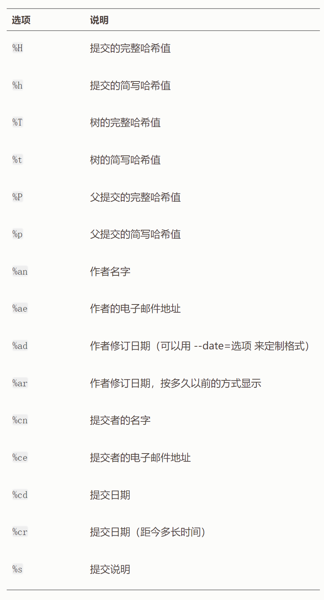

## learngit

### git init

在项目根目录下执行此命令，生成一个.git文件，初始化git

- workspace/untracked:工作区
- staged：暂存区
- unmodified:commit的这里完成一次快照
- modified:修改区间

create file：untracked 通过add 变成staged
staged通过commit变成一次提交/unmodified

### git clone

git clone https://www.github.com/AnOrigami/captcha
从远程仓库克隆项目到运行此命令的目录下，但是项目名为远程仓库项目名
git clone https://www.github.com/AnOrigami/captcha mycaptcha
对克隆到本地进行重命名

### git add

将工作区的文件（未追踪的文件）通过add变为暂存区文件（已追踪文件）

- git add ./utils/monmgodb.go //传入一个路径或具体文件 使用add从工作区保存到暂存区
- git add . //将当前路径下所有工作区的文件和文件夹add到暂存区

### git status

查看当前文件状态

git status -s
git status --short
状态简览

### .gitignore

标明忽略文件，可以使用glob模式
在项目根目录下创建.gitignore这个文件，对于这个文件中指定的文件或路径，git add/git commit都会忽略这些文件

### git diff

查看已暂存和未暂存的modify
git diff通过文件补丁的格式具体的显示出哪些行为发生了变化

git diff --staged/--cached:这条命令将比对已暂存文件与最后一次提交的文件差异
git diff 本身只显示尚未暂存的改动，而不是自上次提交以来所做的所有改动

### git commit

基于暂存区文件进行commit为一次快照

git commit -a :这个操作会将已追踪的所有文件进行commit
git commit -m "hello git commit":对这次commit进行注释

### git rm

从跟踪文件清单中移除，本地也会删除这个文件
git rm file.go
git rm -f file.go
如果是放到暂存区的文件，则需要添加-f进行强制rm操作

git rm --cached file.go:本地不会删除，会从git的暂存区删除

### git mv

git mv file_from file_to

### git log

查看commit记录：最新时间排在最上面

git log -p/--patch:以补丁方式显示每次提交所引入的差异

git log -p -5:显示最近5次的commit

git log --stat:附带每次提交的总结（简略统计信息）

git log --pretty=oneline/short/full/fuller:四种pertty的方式进行展示

git log --pretty=format:"%h - %an, %ar : %s":定制显示格式

其他限制见官网：https://git-scm.com/book/zh/v2/Git-%E5%9F%BA%E7%A1%80-%E6%9F%A5%E7%9C%8B%E6%8F%90%E4%BA%A4%E5%8E%86%E5%8F%B2

### git commit --amend

撤销操作 --amend